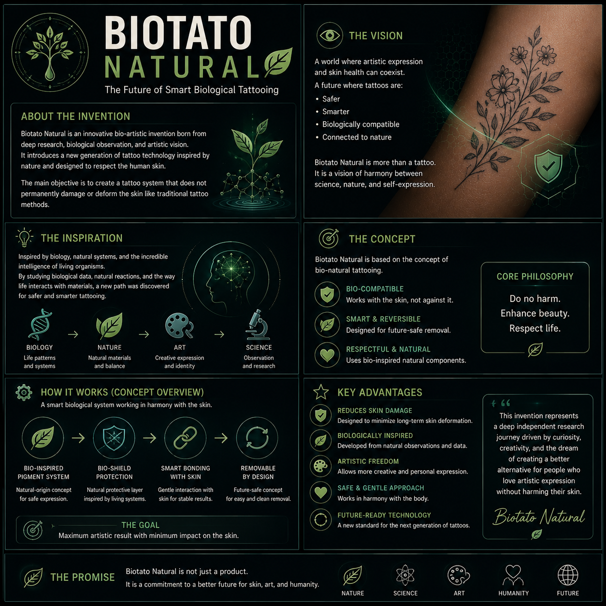
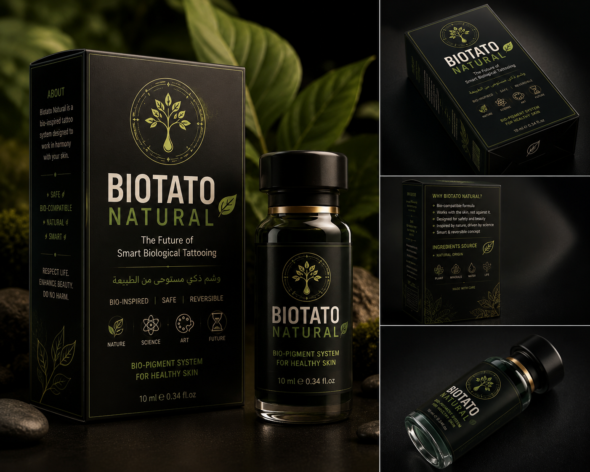

# 🧬 BioTaTo: Advanced Smart Pigment Technology
**Confidential IP - Available for Commercial Acquisition**

  

BioTaTo represents a breakthrough in bio-interface technology. This proprietary system offers a safe, reversible, and magnetic pigment solution for medical and cosmetic applications.

---

## 🔬 How It Works (Concept Overview)

  

### Key Technical Pillars:
* **Safe Encapsulation:** Uses a proprietary bio-matrix to prevent skin irritation.
* **Dynamic Response:** Magnetic properties allow for non-invasive interaction.
* **Controlled Reversal:** Can be fully extracted using a specific enzymatic activator.

---

## 📦 Commercial Readiness

  

### 💰 Business Inquiries & Acquisition
The full **Technical Dossier**, including source codes and specific formulations, is available for purchase.

**Contact for serious inquiries:**
📧 **infosvusial@gmail.com**

*Note: Technical details will only be disclosed to verified parties under a Non-Disclosure Agreement (NDA).*

---
*© 2026 BioTaTo Engineering | Human-Centric AI Engineering*
